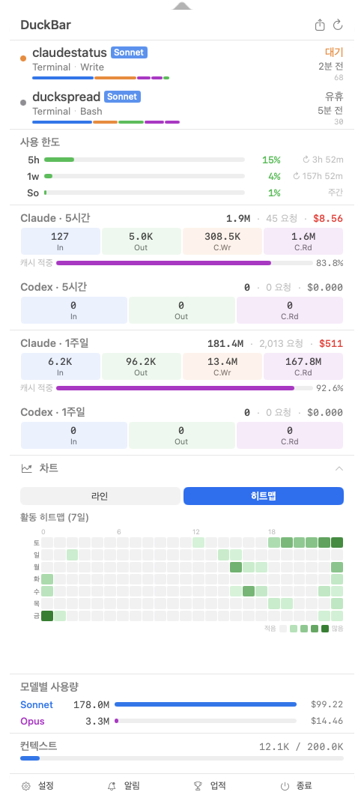
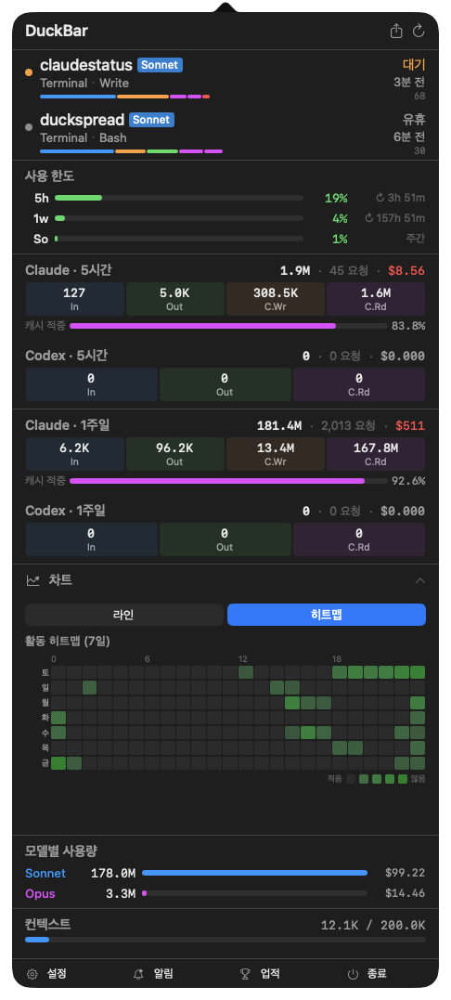

# DuckBar

A macOS menu bar status app for real-time monitoring of Claude Code sessions. View active sessions, API usage, token consumption, context window size, and costs at a glance.


> 🇰🇷 [한국어 README](README.md)

## Screenshots



### Menu Bar
| Light Mode | Dark Mode |
|:-:|:-:|
|  |  |

### Popover
| Light Mode | Dark Mode |
|:-:|:-:|
|  |  |
|  |  |
|  |  |

## Requirements

- **macOS 14 (Sonoma)** or later
- Supports both **Apple Silicon (arm64)** and **Intel (x86_64)**

## Installation

1. Download `DuckBar-x.x.x.zip` from the [latest release](https://github.com/rofeels/duckbar/releases/latest)
2. Unzip and drag `DuckBar.app` to `/Applications`
3. On first launch, right-click → Open to bypass Gatekeeper

> For subsequent updates, use **right-click → Check for Updates...** inside the app for automatic installation.

## Features

### Menu Bar Icon & Animation
- **Duck foot pixel art icon** (7x18px): Visualizes status with a cute design
- **Dynamic walking animation**: The duck feet waddle when active sessions are running
- **Status color coding**: Active (green), Waiting (orange), Compacting (blue), Idle (gray)

### Session Monitoring
- **Automatic Claude Code session detection**: Supports Terminal, IDE (VS Code, Cursor, Xcode, Zed, etc.), iTerm2, Warp, WezTerm, Ghostty
- **Session state tracking**: Active (real-time work), Waiting (recent activity), Compacting (cache cleanup), Idle (inactive)
- **Real-time updates**: Immediate state reflection via file system watching + polling
- **Detailed info display**: Working directory, runtime, last activity, model used, tool call statistics

### API Usage & Token Tracking
- **5-hour usage**: API rate limit usage ratio within the last 5 hours
- **1-week usage**: API rate limit usage ratio within the last week
- **Per-model weekly limits** (optional): Weekly usage rate per Opus/Sonnet model
- **5-hour/1-week token stats**: Separate aggregation of input, output, cache creation, and cache read tokens
- **Token formatting**: Auto-formatted by scale (e.g., 1K, 1.2M)
- **Cache efficiency analysis**: Cache hit rate (%) visualization

### Cost Tracking
- **5-hour and 1-week estimated costs**: Real-time calculation in USD
- **Comma formatting**: Clear display in $1,234.56 format
- **Per-model costs**: Separate calculation for Opus, Sonnet, Haiku models

### Model Usage
- **Per-model token aggregation**: Statistics by model used (Opus, Sonnet, Haiku, etc.)
- **Cost and ratio display**: Visualization of relative usage per model

### Context Window Monitoring
- **Current usage tracking**: Input tokens + cache read tokens for the current session
- **Max context display**: Per-model maximum context (200K or 1M tokens)
- **Usage progress indicator**: Visual progress (%) with color coding (blue → orange → red)

### Menu Bar Status Text
The following can be displayed in real time on the menu bar (customizable via Settings):
- `5h 42%` - 5-hour usage rate
- `1w 68%` - 1-week usage rate
- `12.3K` - 5-hour tokens
- `1.2M` - 1-week tokens
- `$1.23` - 5-hour cost
- `$15.40` - 1-week cost
- `ctx 65%` - context usage rate

### Right-click Context Menu
- Refresh: Immediately update data
- Settings: Open settings screen in the popover
- About: Show app information
- Quit: Exit the app

### Launch at Login
- **Launch at Login**: Official auto-start support via System Preferences
- **ServiceManagement**: Uses macOS 13+ official API

### Refresh Interval Settings
- Choose from **1s, 3s, 5s, 10s, 30s, 1min, 3min, 5min**
- Session state is polled at the configured interval
- Token/usage data is refreshed in the background at 6x the configured interval (minimum 30 seconds)

### Automatic Popover Sizing
- **Small**: 340x500, font scale 1.0x
- **Medium**: 400x580, font scale 1.15x (default)
- **Large**: 460x660, font scale 1.3x
- Auto-expands based on content height (up to maximum)

### Dark Mode Support
- **Automatic dynamic colors**: Instantly reflects macOS system dark mode changes
- **Dynamic icon colors**: Automatic color adjustment per theme

### Localization
- **Korean**: Default language (based on system language setting)
- **English**: Available as an option
- Menus, status bar, popover, and settings screen all support multiple languages

## Build (For Developers)

```bash
git clone https://github.com/rofeels/duckbar.git
cd duckbar
./build.sh
cp -r .build/app/DuckBar.app /Applications/
```

## Tech Stack

| Technology | Purpose |
|-----|------|
| **Swift 5.9** | Main programming language |
| **SwiftUI** | UI development |
| **AppKit** | Menu bar and popover management |
| **SPM** | Dependency management |

## Dependencies

- **[Sparkle](https://sparkle-project.org)**: Automatic updates
- **[HotKey](https://github.com/soffes/HotKey)**: Global hotkey (Carbon API)

## Structure

```
Sources/DuckBar/
├── AppDelegate.swift          # Menu bar icon, animation, popover management
├── StatusMenuView.swift       # Popover UI and data display
├── SettingsView.swift         # Settings screen
├── AppSettings.swift          # Settings model and storage
├── Models.swift               # Data models (sessions, tokens, API usage, etc.)
├── SessionMonitor.swift       # Session monitoring and polling
├── SessionDiscovery.swift     # Claude Code session detection and stats loading
└── Localization.swift         # Localization strings

Resources/
├── Info.plist                 # App metadata
└── AppIcon.icns               # Menu bar icon
```

## Usage

### Basic Usage

1. Launch the app — a duck foot icon appears in the menu bar
2. Click the icon to open the popover with detailed information
3. Right-click for Refresh, Settings, and Quit menu options

### Settings

Access via the **Settings** button (gear icon) in the popover:

- **Language**: Korean / English
- **Popover size**: Small / Medium / Large
- **Launch at Login**: Enable/disable via toggle
- **Refresh interval**: 1 second to 5 minutes
- **Menu bar display items**: Enable/disable each item individually with preview

### Refresh

- Click the **Refresh** button (arrow icon) in the popover header
- Right-click menu > **Refresh**
- Automatic background refresh runs at the configured interval

## License

MIT License — see [LICENSE](LICENSE)

## Support

If you encounter an issue:

1. Try restarting the app
2. Check **Settings > Refresh Interval**
3. Check the **Settings > Launch at Login** toggle
4. Verify that Claude Code (`~/.claude` directory) is correctly installed

## Development

### Development Setup

```bash
# Clone the source
git clone <repo-url>
cd duckbar

# Check dependencies (not needed — SPM handles this automatically)

# Development build
swift build

# Debug run
swift run DuckBar
```

### Code Style

- Follows Swift standard style
- Uses `@MainActor` / `@Observable` macros
- Concise error handling

## Known Limitations

- Displays "No sessions" when no Claude Code sessions are active
- Stale sessions are automatically cleaned up
- API usage may be delayed due to network latency (up to 5-minute cache)
