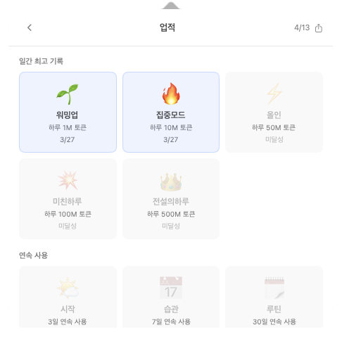
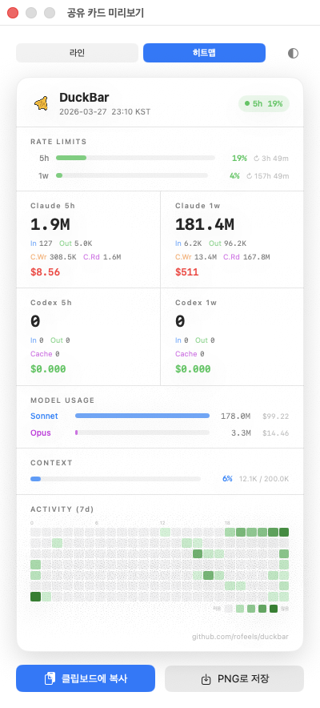
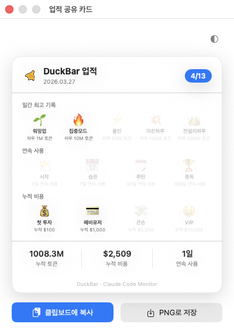
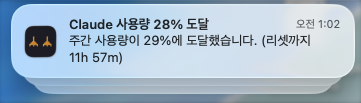
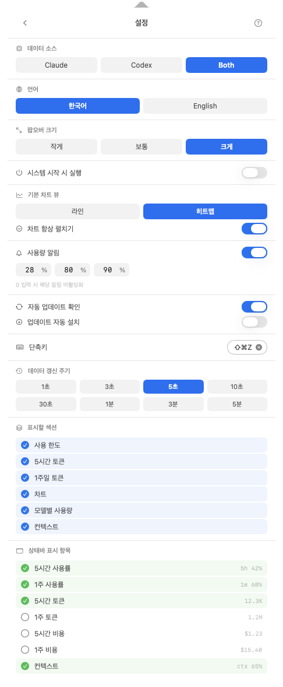

# DuckBar

A macOS menu bar status app for real-time monitoring of Claude Code / Codex sessions. View active sessions, API usage, token consumption, costs, achievements, and weekly reports at a glance.


> 🇰🇷 [한국어 README](README.md)

## Screenshots


### Menu Bar
| Light Mode | Dark Mode |
|:-:|:-:|
|  |  |

### Popover
| Light Mode | Dark Mode |
|:-:|:-:|
|  |  |

### Feature Screens
| Achievements | Weekly Report |
|:-:|:-:|
|  |  |

| Badge Share Card | Usage Alert |
|:-:|:-:|
|  |  |

### Settings


## Requirements

- **macOS 14 (Sonoma)** or later
- Supports both **Apple Silicon (arm64)** and **Intel (x86_64)**

## Installation

### Direct Download
1. Download `DuckBar-x.x.x.zip` from the [latest release](https://github.com/rofeels/duckbar/releases/latest)
2. Unzip and drag `DuckBar.app` to `/Applications`
3. On first launch, right-click → Open to bypass Gatekeeper

> For subsequent updates, use **right-click → Check for Updates...** inside the app for automatic installation.

### Homebrew
```bash
brew tap rofeels/duckbar https://github.com/rofeels/duckbar
brew install --cask duckbar
```

## Features

### Multi-Provider (Claude + Codex)
- Monitor **Claude Code / OpenAI Codex** session data separately or combined
- Choose **Claude / Codex / Both** in Settings
- Token, cost, and session stats aggregated per provider

### Session Monitoring
- **Automatic session detection**: Terminal, VS Code, Cursor, Xcode, Zed, iTerm2, Warp, Ghostty, and more
- **Session states**: Active (real-time work), Waiting (recent activity), Compacting (cache cleanup), Idle (inactive)
- **Detailed info**: Working directory, runtime, model used, tool call statistics
- **Real-time updates**: Immediate state reflection via file system watching + polling

### API Usage & Token Tracking
- **5-hour / 1-week usage rate**: Rate Limit consumption ratio (account-wide, fetched from server)
- **Token breakdown**: Input, output, cache creation, and cache read tokens displayed separately
- **Cache efficiency**: Cache hit rate (%) visualization
- **Token formatting**: Auto-scaled display (1K / 1.2M, etc.)

### Cost Tracking
- **5-hour and 1-week estimated costs**: Real-time calculation in USD
- **Per-model costs**: Opus, Sonnet, Haiku / gpt-4.1 calculated separately
- **Cumulative cost**: Total aggregated from full usage history

### Heatmap Chart
- **7-day hourly activity heatmap**: Activity density by day of week × hour
- Toggle between **line chart / heatmap**, with configurable default

### Achievement System
- **13 badges**: Daily peak (1M–500M tokens), streak (3–100 days), cumulative cost ($100–$10,000)
- macOS notification sent automatically when a badge is earned
- **Daily streak** tracking (date-based, resets on missed days)
- **Badge share card**: Export earned badges as an image (copy to clipboard / save as PNG)

### Weekly Report
- Automatically aggregates last week's usage every **Monday** on app start
- Shows token/cost change vs. prior week (+/-%)
- **Day-of-week bar chart** with most active day highlighted
- **Report share card**: Export as image

### Usage Alerts
- **Threshold alerts**: macOS notification when 5-hour/weekly usage reaches configured levels (default: 50%, 80%, 90%)
- 60-minute cooldown, per-session deduplication, re-fires after Rate Limit reset

### Notification History
- Keeps a full history of milestone, weekly report, and usage alerts (up to 50 entries)
- Type-specific icons/colors, relative time display, clear all option

### Share Card
- **Snapshot card**: Export current token/cost/model usage as an image
- Provider-aware rendering (Claude / Codex / Both)
- Copy to clipboard or save as PNG

### Context Window Monitoring
- **Current session usage**: Input tokens + cache read tokens
- **Per-model max context**: 200K or 1M tokens
- **Color progress bar**: Blue → Orange → Red

### Menu Bar Customization
Configure which items appear in the menu bar in real time:
- `5h 42%` / `1w 68%` — 5-hour/1-week usage rate
- `12.3K` / `1.2M` — 5-hour/1-week tokens
- `$1.23` / `$15.40` — 5-hour/1-week cost
- `ctx 65%` — context usage rate

### More
- **Dark mode**: Automatically follows system setting
- **Localization**: Korean (default) / English
- **Launch at Login**: ServiceManagement API (macOS 13+)
- **Popover size**: Small / Medium / Large, auto-adjusts to content
- **Refresh interval**: 1 second to 5 minutes

## Build (For Developers)

```bash
git clone https://github.com/rofeels/duckbar.git
cd duckbar
./build.sh
cp -r .build/app/DuckBar.app /Applications/
```

## Usage

1. Launch the app — a duck foot icon appears in the menu bar
2. Click the icon to open the popover with detailed information
3. Right-click for Refresh / Settings / Quit

### Settings
Access via the gear icon in the top-right of the popover:
- **Provider**: Claude / Codex / Both
- **Language**: Korean / English
- **Popover size**: Small / Medium / Large
- **Refresh interval**: 1 second to 5 minutes
- **Visible sections**: Show/hide each section individually
- **Default chart**: Line chart / Heatmap
- **Usage alerts**: Configure thresholds (3 levels)
- **Auto-update**: Check / auto-install toggle
- **Menu bar items**: Enable per-item with live preview

### Achievements & Notification History
Access via the trophy / bell icons at the bottom of the popover:
- **Achievements**: View earned badges and generate share cards
- **Notification History**: Browse all past notifications

## Tech Stack

| Technology | Purpose |
|-----|------|
| **Swift 5.9** | Main programming language |
| **SwiftUI** | UI development |
| **AppKit** | Menu bar and popover management |
| **SPM** | Dependency management |

## Dependencies

- **[Sparkle](https://sparkle-project.org)**: Automatic updates
- **[HotKey](https://github.com/soffes/HotKey)**: Global hotkey

## Project Structure

```
Sources/DuckBar/
├── AppMain.swift                  # App entry point
├── AppDelegate.swift              # Menu bar icon, animation, popover management
├── AppSettings.swift              # Settings model and storage
├── Models.swift                   # Data models (sessions, tokens, provider, etc.)
├── Localization.swift             # Localization strings
├── SessionMonitor.swift           # Session monitoring and polling
├── SessionDiscovery.swift         # Session detection and JSONL parsing
├── StatusMenuView.swift           # Popover main UI
├── SessionRowView.swift           # Session row component
├── SettingsView.swift             # Settings screen
├── HelpView.swift                 # Help screen
├── TokenChartView.swift           # Token chart (line / heatmap)
├── PopoverPanel.swift             # Popover panel management
├── ShareCardView.swift            # Share card view
├── ShareCardWindow.swift          # Share card window
├── BadgeView.swift                # Achievement badges screen
├── BadgeShareCardView.swift       # Badge share card
├── MilestoneManager.swift         # Badge condition checks and achievement logic
├── WeeklyReportManager.swift      # Weekly report generation and delivery
├── WeeklyReportCardView.swift     # Weekly report share card
├── UsageAlertManager.swift        # Usage threshold alerts
├── NotificationHistoryManager.swift # Notification history storage
└── NotificationHistoryView.swift  # Notification history screen

Resources/
├── Info.plist                     # App metadata
├── AppIcon.icns                   # App icon
└── duck_icon.png                  # Duck icon for share cards
```

## Known Limitations

- Displays "No sessions" when no Claude Code sessions are active
- Token counts reflect only this device's usage (Rate Limit % is account-wide)
- Codex sessions require `~/.codex/sessions/` directory to exist
- Weekly report is sent once per Monday on first app launch that day
- API usage rate may be delayed up to 5 minutes due to caching

## License

MIT License — see [LICENSE](LICENSE)

## Support

If you encounter an issue, please file a report at [GitHub Issues](https://github.com/rofeels/duckbar/issues).

1. Try restarting the app
2. Check **Settings > Refresh Interval**
3. Verify that Claude Code (`~/.claude`) / Codex (`~/.codex`) is correctly installed
